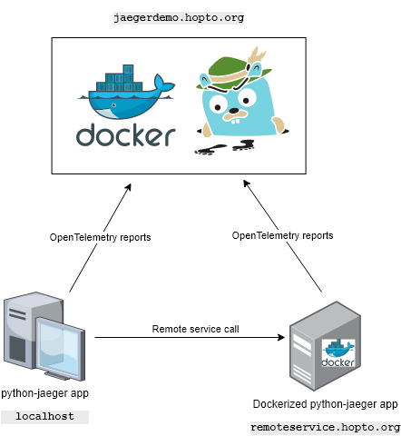

# OpenTelemetry Demo w/Python

This is sample demo Python project which illustrates how Open Telemetry works.
As an OpenTelemetry API implementation in our case is [Jaeger](https://www.jaegertracing.io/).

                                 
To simplify the demo we'll use free DNS names from [noip.com](https://www.noip.com/).

Let's use NoIP's "**hopto.org**" zone for our demo purposes.

## Principal schema




## Hosts
In this demo we will use 3 hosts:
- **localhost** (for starting python-jaeger application from sources or docker)
- **remoteservice.hopto.org** (for starting 2nd instance if python-jaeger application, i.e. some remote service to call from the 1st service, which is running on localhost) and
- **jaegerdemo.hopto.org** (Jaeger UI, data collector)

## Docker

Everything which is needed for this demo is available as Docker images, so we'll use Docker to run Jaeger and python-jaeger applications.


## Why "localhost" is needed?

In this demo we will use 2 instances of **python-jaeger** application. 
The 1st instance will be running on _localhost_ (from sources or Docker container) and the 2nd instance will be running on remote host (**remoteservice.hopto.org**). The 1st instance may report all activities to Jaeger collector directly (e.g. calling it's `/v1/worker` endpoint) or demonstrate a "cascade-call", calling `/v1/remotecall` with configured environment variable `-e REMOTE_URL_TO_CALL=remoteservice.hopto.org` calling the 2nd instance as a demo of complex multi-worker microservice architecture.
We may use either **localhost** or *remoteservice.hopto.org** for simple demo, but we need both for more complex demo.
We will see the result (report) of this "cascade-call" in Jaeger UI width 2 spans (1st span is for the 1st instance and 2nd span is for the 2nd instance). 

## How to run
              
### 1. Jaeger 
Go to _jaegerdemo.hopto.org_ (having Docker service installed there, firewall opened) and run Jaeger collector and UI:
```bash
docker run -it --net=host jaegertracing/all-in-one:latest
```
Let's use `--net=host` for easier TCP/UDP ports management (N.B. security is out of this demo scope) 
                         

### 2. Localhost
On the _localhost_ machine run _python-jaeger_ application either from Docker image or from sources. If we want to check the "cascade-call", start the optional 2nd _python-jaeger_ instance (see below the 3rd option)

Running from sources on Windows machine may look like this:
```
g:\Projects\python-jaeger>set OTEL_EXPORTER_JAEGER_AGENT_HOST=jaegerdemo.hopto.org

g:\Projects\python-jaeger>set OTEL_EXPORTER_JAEGER_AGENT_PORT=6831

g:\Projects\python-jaeger>set REMOTE_URL_TO_CALL=http://remoteservice.hopto.org/api/v1/worker

g:\Projects\python-jaeger>python app/main.py
 * Serving Flask app "main" (lazy loading)
 * Environment: production
   WARNING: This is a development server. Do not use it in a production deployment.
   Use a production WSGI server instead.
 * Debug mode: off
 * Running on http://0.0.0.0:8080/ (Press CTRL+C to quit)
```
Application will be available at `http://localhost:8080`

Pay attention to the environment variables: for Jaeger collector we use `OTEL_EXPORTER_JAEGER_AGENT_HOST` and `OTEL_EXPORTER_JAEGER_AGENT_PORT` (UDP port).

In case of Docker usage we may run it like this:
```bash
docker run -it --net=host -e REMOTE_URL_TO_CALL=remoteservice.hopto.org -e OTEL_EXPORTER_JAEGER_AGENT_HOST=jaegerdemo.hopto.org -e OTEL_EXPORTER_JAEGER_AGENT_PORT=6831 dimedrol/python-jaeger
```

**REMOTE_URL_TO_CALL** environment variable is optional, if it's not set, the "https://en.wikipedia.org/wiki/Tracing_(software)" value will be used for demo purposes.


### 3. Remote service (optional)
(Optional) On the _remoteservice.hopto.org_ machine (having Docker service installed there, firewall opened) and run dockerized python-jaeger application: 
```bash
docker run -it --net=host -e OTEL_EXPORTER_JAEGER_AGENT_HOST=jaegerdemo.hopto.org -e OTEL_EXPORTER_JAEGER_AGENT_PORT=6831 dimedrol/python-jaeger
```
Using `--net=host` here as well. 
Pay attention to the environment variables: for Jaeger collector we use `OTEL_EXPORTER_JAEGER_AGENT_HOST` and `OTEL_EXPORTER_JAEGER_AGENT_PORT` (UDP port).


### 4. Ready
Make some requests from Swagger UI `http://localhost:8080/api/` and/or `http://remoteservice.hopto.org/api/` and check the results in Jaeger UI `http://jaegerdemo.hopto.org:16686/`

eof